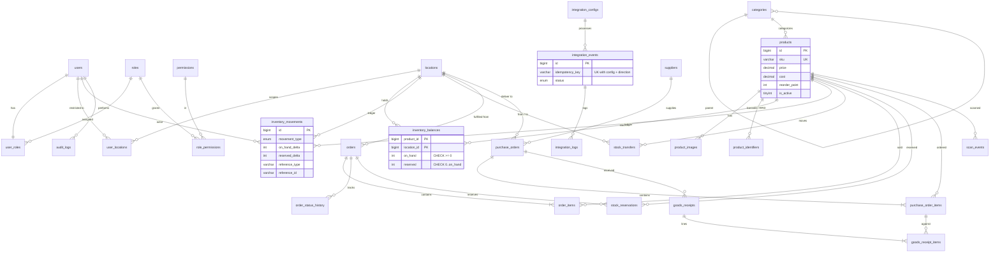

# Entity-relationship diagram

```mermaid
erDiagram
  users ||--|| user_roles : has
  roles ||--o{ user_roles : assigned
  roles ||--o{ role_permissions : grants
  permissions ||--o{ role_permissions : in
  users ||--o{ user_locations : "restricted to"
  locations ||--o{ user_locations : scopes
  categories ||--o{ categories : parent
  categories ||--o{ products : categorizes
  products ||--o{ product_images : has
  products ||--o{ product_identifiers : "barcode / RFID"
  products ||--o{ inventory_balances : stocked
  locations ||--o{ inventory_balances : holds
  products ||--o{ inventory_movements : ledger
  locations ||--o{ inventory_movements : ledger
  users ||--o{ inventory_movements : actor
  products ||--o{ stock_transfers : moves
  locations ||--o{ stock_transfers : "from / to"
  locations ||--o{ orders : "fulfilled from"
  orders ||--|{ order_items : contains
  products ||--o{ order_items : sold
  orders ||--o{ order_status_history : tracks
  orders ||--o{ stock_reservations : reserves
  products ||--o{ stock_reservations : reserved
  suppliers ||--o{ purchase_orders : supplies
  locations ||--o{ purchase_orders : "deliver to"
  purchase_orders ||--|{ purchase_order_items : contains
  products ||--o{ purchase_order_items : ordered
  purchase_orders ||--o{ goods_receipts : received
  goods_receipts ||--|{ goods_receipt_items : lines
  purchase_order_items ||--o{ goods_receipt_items : against
  products ||--o{ scan_events : scanned
  integration_configs ||--o{ integration_events : processes
  integration_events ||--o{ integration_logs : logs
  users ||--o{ audit_logs : performs

  products { bigint id PK
    varchar sku UK
    decimal price
    decimal cost
    int reorder_point
    tinyint is_active }
  inventory_balances { bigint product_id PK
    bigint location_id PK
    int on_hand "CHECK >= 0"
    int reserved "CHECK 0..on_hand" }
  inventory_movements { bigint id PK
    enum movement_type
    int on_hand_delta
    int reserved_delta
    varchar reference_type
    varchar reference_id }
  integration_events { bigint id PK
    varchar idempotency_key "UK with config + direction"
    enum status }
```

Shared entities (`products`, `locations`, `users`) are referenced by foreign keys everywhere; nothing is duplicated between modules.
